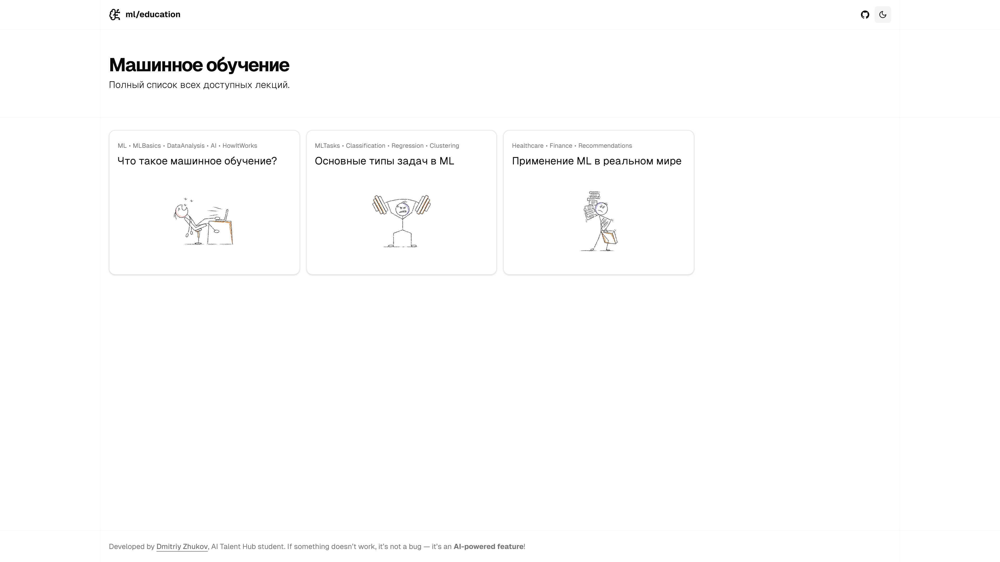
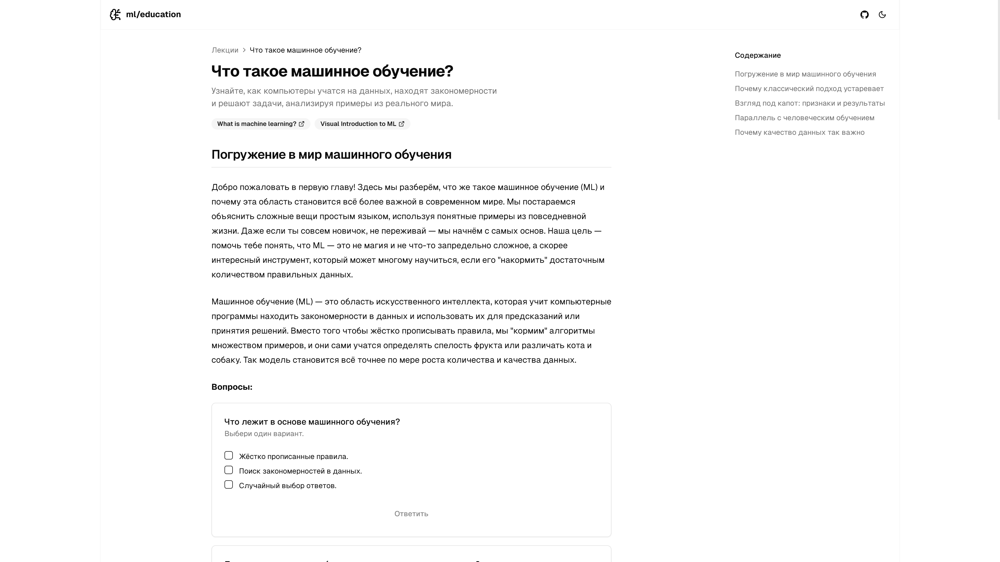
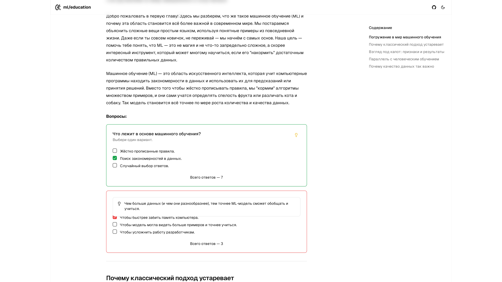

# ML Education

This project is built on [Next.js](https://nextjs.org) using [`create-next-app`](https://nextjs.org/docs/app/api-reference/cli/create-next-app).

## Project Overview

`ML Education` is an educational blog designed to introduce high school students and students from other IT disciplines to the fundamentals of Artificial Intelligence (AI) and Machine Learning (ML). The blog provides:

- **Lectures**: Simplified explanations of complex AI concepts.
- **Quizzes**: To reinforce knowledge and increase engagement.
- **Real-world examples**: How AI and ML are used in industries like healthcare, finance, and recommendation systems.

The blog is designed to spark interest in AI and inspire students to continue learning and pursue a master's degree at AI Talent Hub.

## Features

1. **Thematic Lectures**
   - Example topics: "What is Machine Learning?", "Key ML Task Types", "Real-world Applications of ML".
   - Content includes textual explanations and visual materials.

2. **Quizzes**
   - Quizzes are embedded in lectures to test understanding.
   - Users receive instant feedback on their answers.

3. **Intuitive Design**
   - User-friendly interface suitable for all levels of knowledge.

## Screenshots

### Home Page
The homepage provides an overview of available lectures.



### Lecture Details
Detailed lecture view with textual explanations, examples, and structured content.



### Interactive Quiz
Example quiz with instant feedback on answers.



## Getting Started

To start the application, run the following commands:

```bash
cd blog
npm run build:content
```

```bash
npm run dev
# or
yarn dev
# or
pnpm dev
# or
bun dev
```

Open [http://localhost:3000](http://localhost:3000) in your browser to view the result.

## How This Supports AI Talent Hub

Project Goals:

1. Increase awareness of the AI Talent Hub master's program among students.
2. Create engaging and accessible content to attract a broad audience.
3. Motivate students to explore AI as a career path.

## Technologies Used

- **Framework**: Next.js (React.js)
- **Language**: TypeScript
- **Styling**: Tailwind CSS
- **Content Management**: Markdown for lectures (MDX)

## Contribution

Developed by Dmitriy Zhukov, a master's student at AI Talent Hub. If you encounter any issues or have suggestions for improvement, feel free to contribute via GitHub.

