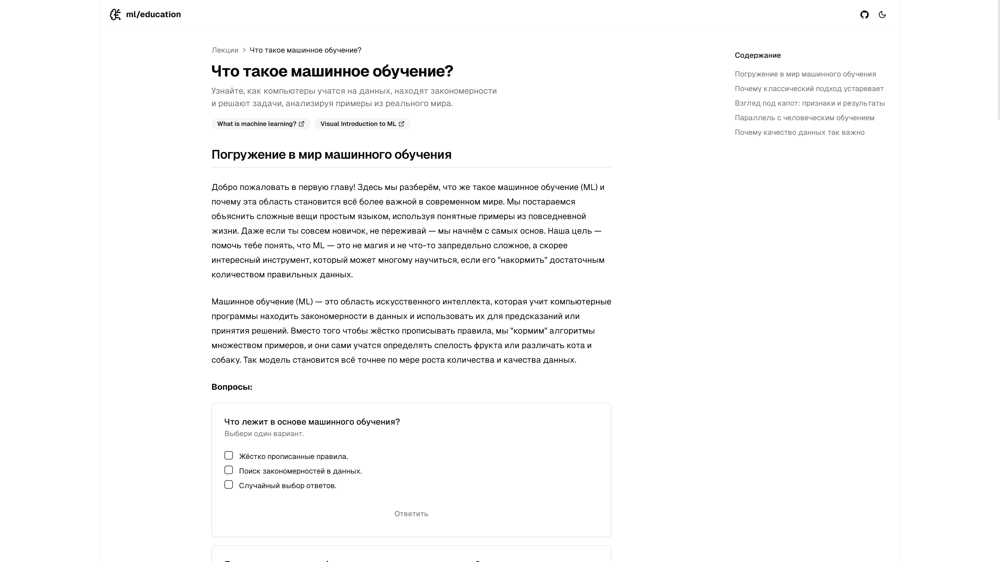

# ai-course-education

Этот проект создан на базе [Next.js](https://nextjs.org) с использованием [`create-next-app`](https://nextjs.org/docs/app/api-reference/cli/create-next-app).

## Обзор проекта

`ai-course-education` — это образовательная блог, направленная на ознакомление старшеклассников и студентов других IT-направлений с основами Искусственного Интеллекта (AI) и Машинного Обучения (ML). Блог предоставляет:

- **Лекции**: Простые объяснения сложных концепций AI.
- **Тесты**: Для закрепления знаний и повышения интереса к обучению.
- **Примеры из реального мира**: Как AI и ML используются в таких сферах, как здравоохранение, финансы и рекомендательные системы.

Блог разработан для того, чтобы пробудить интерес к AI и вдохновить студентов на дальнейшее обучение и поступление в магистратуру AI Talent Hub.

## Возможности

1. **Лекции по темам**
   - Примеры тем: "Что такое машинное обучение?", "Основные типы задач в ML", "Применение ML в реальном мире".
   - Контент включает текстовые объяснения и визуальные материалы.

2. **Тесты**
   - Тесты встроены в лекции для проверки понимания.
   - Пользователи получают мгновенную обратную связь по своим ответам.

3. **Интуитивный дизайн**
   - Удобный интерфейс для всех уровней подготовки.

## Скриншоты

### Главная страница
На главной странице представлен обзор доступных лекций.


### Детали лекции
Подробный вид лекции, включающий текстовые объяснения, примеры и структурированное содержание.



### Интерактивный тест
Пример теста с мгновенной обратной связью на ответы.


## Начало работы

Для запуска приложения выполните следующие команды:

```bash
cd blog
npm run build:content
```

```bash
npm run dev
# или
yarn dev
# или
pnpm dev
# или
bun dev
```

Откройте [http://localhost:3000](http://localhost:3000) в браузере, чтобы увидеть результат.

## Как это помогает AI Talent Hub

Цели проекта:

1. Увеличение осведомлённости о магистратуре AI Talent Hub среди студентов.
2. Создание увлекательного и доступного контента для привлечения широкой аудитории.
3. Мотивация студентов к изучению AI как карьерного направления.

## Используемые технологии

- **Фреймворк**: Next.js (React.js)
- **Язык**: TypeScript
- **Стилизация**: Tailwind CSS
- **Управление контентом**: Markdown для лекций (mdx)

## Вклад

Разработано Дмитрием Жуковым, магистрантом AI Talent Hub. Если вы столкнулись с проблемами или у вас есть предложения по улучшению, вы можете внести вклад через GitHub.
